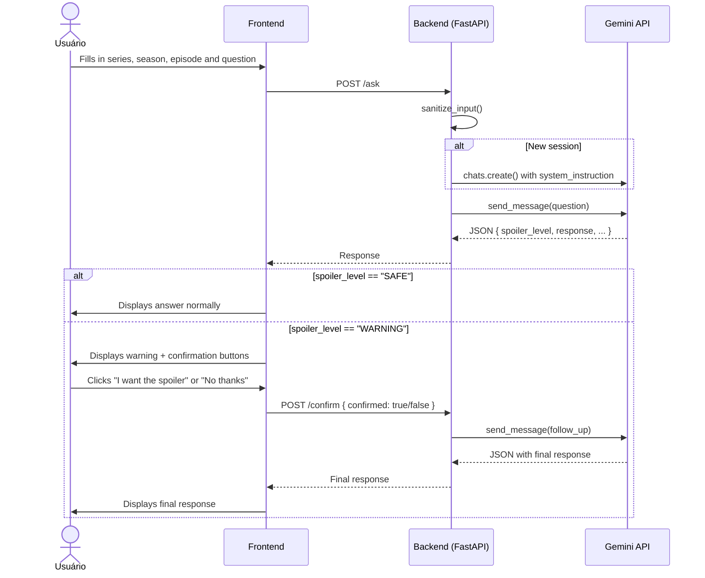
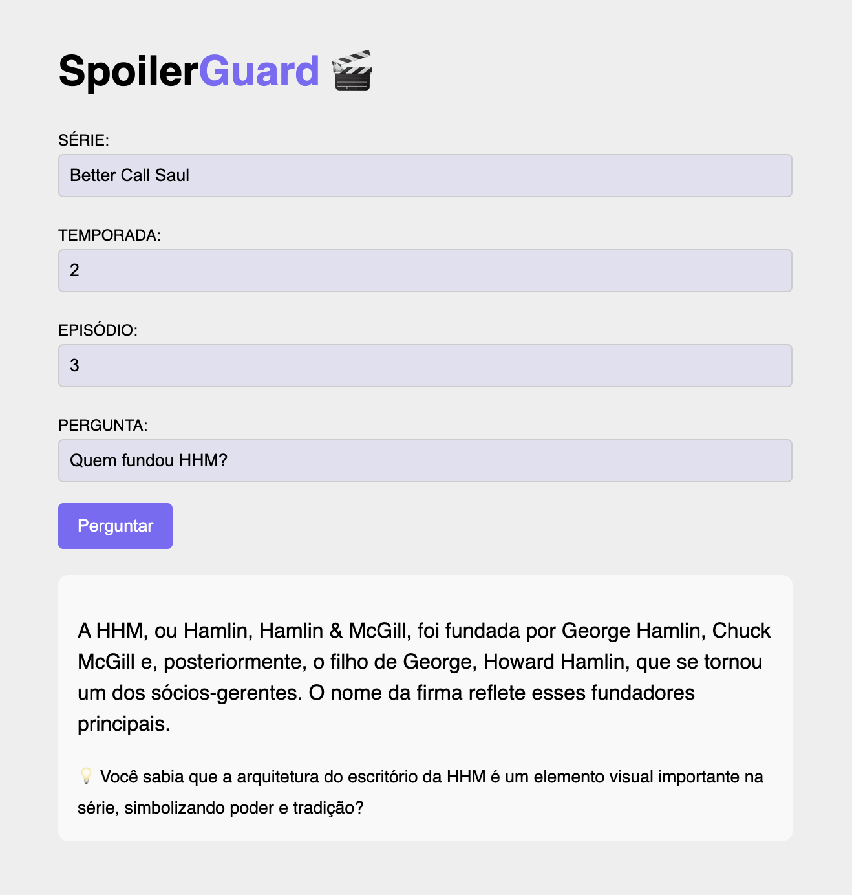
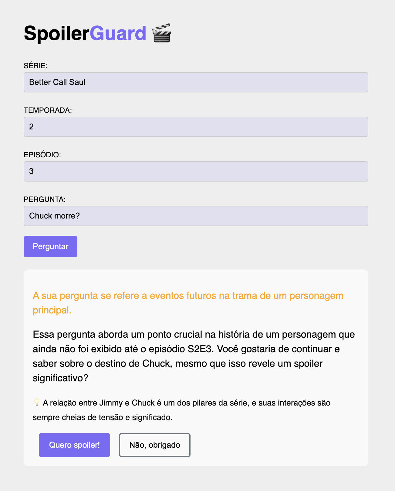

# SpoilerGuard 🎬

A learning project focused on LLM integration with REST APIs. The idea came from a real problem: wanting to talk about TV series without getting spoiled on episodes I haven't watched yet.

The user provides the series, season, and episode they stopped at, then asks questions freely. The model classifies each response as `SAFE` or `WARNING` — if `WARNING`, it blocks the answer and asks for confirmation before revealing anything.

---

## Flow



---

 
## Interface
 


 
---

## Learning Objectives

This project was built to study the following concepts in practice:

**LLM Integration**
- Using the official Google Gemini SDK in Python
- Creating and managing chat sessions with conversation history
- Structured JSON output from an LLM via `response_mime_type`
- Prompt engineering: system prompt, strict output format and context injection via f-string
- Using the model's classification as an explicit step before answering
- Input sanitization to mitigate prompt injection

**Backend**
- Building a REST API with FastAPI and Pydantic
- Modeling endpoints with dependencies between them (`/ask` → `/confirm`)
- In-memory session state management
- Error handling with retry and linear backoff for external APIs

**Frontend**
- Consuming a REST API with vanilla JavaScript `fetch`
- Persisting `session_id` with `localStorage`
- Chaining two API calls with shared state
- Handling HTTP errors with user-friendly feedback

**Systems Design**
- Separation of concerns between classification and response
- Trade-offs of simplicity vs robustness (in-memory state vs Redis)
- Why redundancy in prompts is noise, not safety

---

## Stack

- **Backend:** FastAPI + Google Gemini (`gemini-2.5-flash`)
- **Frontend:** Vanilla HTML/CSS/JS

---

## Prerequisites

- Python 3.10+
- API key from [Google AI Studio](https://aistudio.google.com/)

## Installation

```bash
git clone https://github.com/amrdomenico/SpoilerGuard.git
cd spoilerguard

python -m venv .venv
source .venv/bin/activate  # Windows: .venv\Scripts\activate

pip install -r requirements.txt
```

Create a `.env` file in the project root:

```
GEMINI_API_KEY=your_key_here
```

## Running the project

**Backend:**
```bash
uvicorn main:app --reload
```
API runs at `http://localhost:8000`.

**Frontend:**
```bash
python -m http.server 3000
```
Open `http://localhost:3000` in your browser.

---

## Endpoints

| Method | Route | Description |
|--------|-------|-------------|
| POST | `/ask` | Send a question about the series |
| POST | `/confirm` | Confirm or decline the spoiler reveal |

### POST `/ask`
```json
{
  "session_id": "uuid",
  "serie": "Better Call Saul",
  "season": "2",
  "episode": "5",
  "question": "Does Chuck die?"
}
```

### POST `/confirm`
```json
{
  "session_id": "uuid",
  "confirmed": true
}
```

### Response (both endpoints)
```json
{
  "spoiler_level": "SAFE | WARNING",
  "warning_message": "string or null",
  "response": "AI response in pt-BR",
  "tip": "optional tip or null"
}
```

---

## Known Limitations

- **In-memory sessions** — restarting the server clears all conversation history. The natural solution would be Redis, but it was intentionally left out to keep the focus on LLM concepts.
- **No authentication** — `session_id` is generated on the frontend and trusted by the backend without additional validation.
- **Minimal UX** — the frontend was kept intentionally simple to focus on the backend and LLM integration. There is no visual chat history and the experience feels more like a form than a conversation.
- **Gemini free tier rate limits** — daily request quota may be reached with heavy usage.
